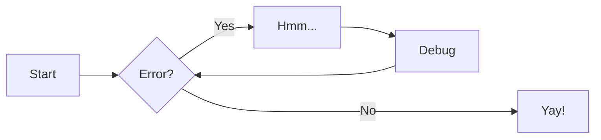
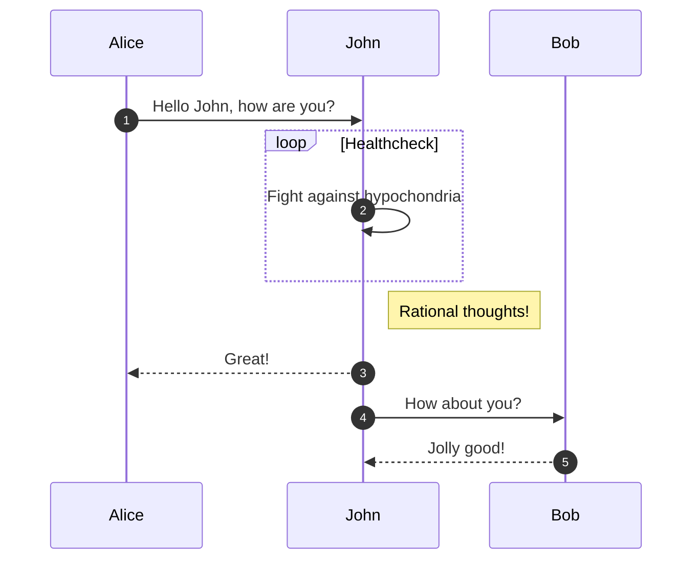
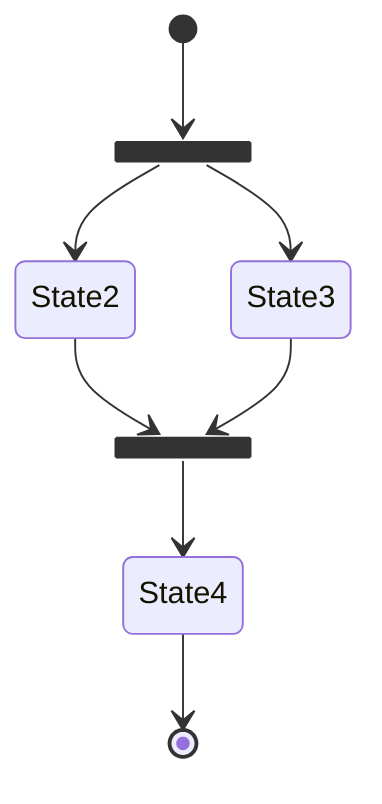

# Mermaid Diagrams

Mermaid diagrams are a great way of codifying diagrams and charts within Markdown documents, and we have enabled a plugin to support these within MkDocs.

The full capability of Mermaid is outlined on the [Mermaid website](https://mermaid.js.org/).

## Flowchart

````markdown

````


## Sequence Diagram

````markdown

````


## State Diagram

```` markdown

````


